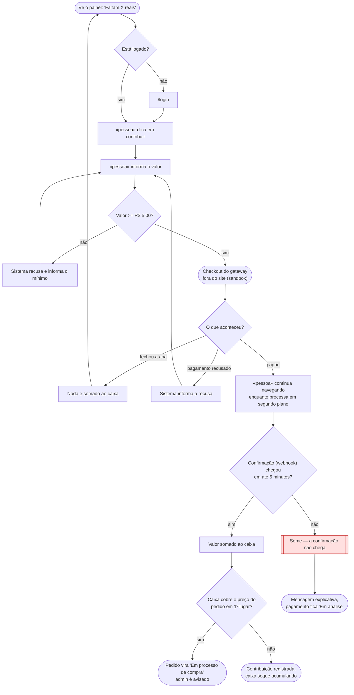

# 🗺️ Jornadas de Usuário

**Projeto:** MuletAí
**Versão:** 1.0.0
**Última atualização:** 2026-09-22

> 🤖 **Este documento é a fonte da verdade sobre O QUE A PESSOA VIVE na tela** —
> o caminho do primeiro clique até o objetivo, e principalmente os pontos onde ela
> trava, espera ou desiste.
>
> ✍️ **Não preencha na mão:** rode `/utf-flows`. A entrevista escolhe a história que
> merece o desenho, obriga o ponto de desistência a aparecer e cobra a decisão sobre
> ele.
>
> 🚫 **Não duplique:** regra de negócio mora no `prd.md`; estado, entidade e contrato
> moram no `architecture.md`. Aqui mora o caminho.

---

## Jornada 1 — Contribuir com dinheiro

**Story:** US04
**Critérios que ela marca:** sai do site e volta · depende do tempo · depende de outra pessoa agir · pode ser abandonada

**O que decidimos sobre o nó vermelho:**

O pagamento roda de forma assíncrona, em segundo plano — como o gateway normalmente abre em outra aba, a pessoa não precisa ficar parada esperando: pode continuar navegando no site enquanto o sistema processa. Se em até 5 minutos a confirmação não chegar, o sistema exibe uma mensagem, a mais explicativa possível dentro do que conseguir captar do erro, e o pagamento fica com o status "em análise" até ser resolvido.

---

## Dúvidas em aberto

| # | Dúvida | Onde ela precisa ser resolvida |
| --- | --- | --- |
